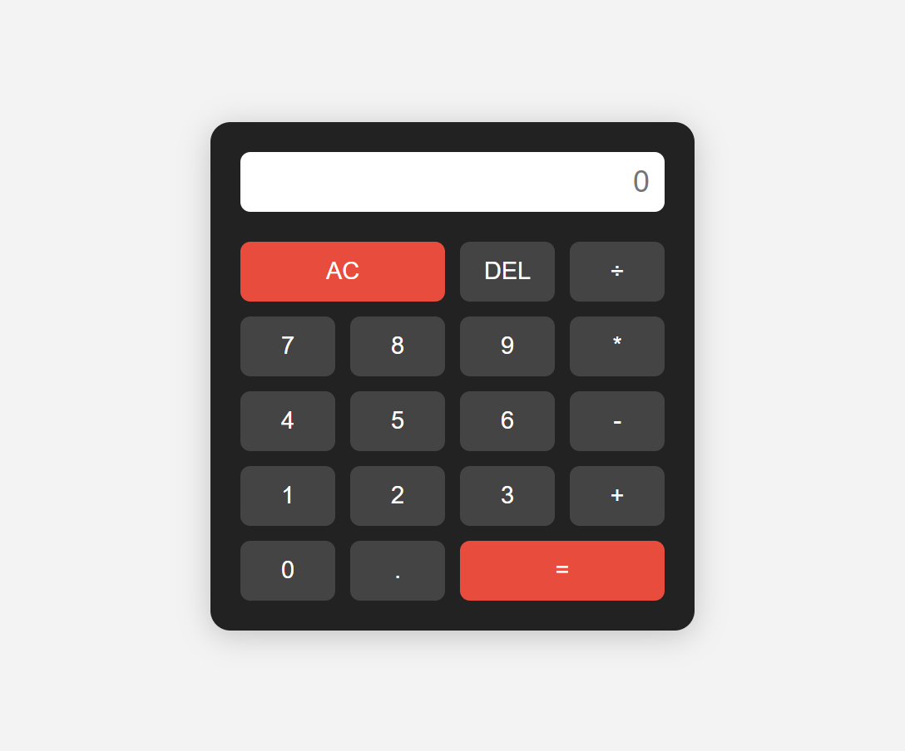

# 🧮 Simple Calculator

A simple and responsive calculator built with **HTML**, **CSS**, and **vanilla JavaScript**.
It performs basic arithmetic operations and supports both mouse and keyboard input.

---

## ✨ Features

- Responsive layout (desktop & mobile)
- Basic math operations: `+`, `-`, `*`, `÷`
- Decimal input support
- Clear (`AC`) and Delete (`DEL`) functionality
- Keyboard support (numbers, operators, Enter, Backspace, Esc)

---

## 📁 Folder Structure

```
calculator/
├── index.html       # Main HTML file for the calculator UI
├── style.css        # CSS file for styling and responsiveness
├── main.js          # JavaScript file for calculator logic and keyboard support
├── screenshot.png   # Screenshot image of the calculator
└── README.md        # Project documentation (this file)
```


---

## 🚀 Demo

Live demo (if deployed with GitHub Pages):
👉 [https://rizwan-ullah-tech.github.io/Calculator/](https://rizwan-ullah-tech.github.io/Calculator/)

---

## 📸 Screenshot



---

## 📚 How to Use

1. Clone the repository:
   ```bash
   git clone https://github.com/your-username/calculator.git
    ```
2. Open `index.html` in your web browser.
3. Use the mouse or keyboard to perform calculations.

## Technologies Used
- HTML5
- CSS3
- JavaScript (vanilla)

## Author
- Rizwan Ullah
- [Rizwan.ullah.tech@gmail.com](mailto:Rizwan.ullah.tech@gmail.com)
- [Rizwan-Ullah-tech](https://github.com/Rizwan-Ullah-tech)


